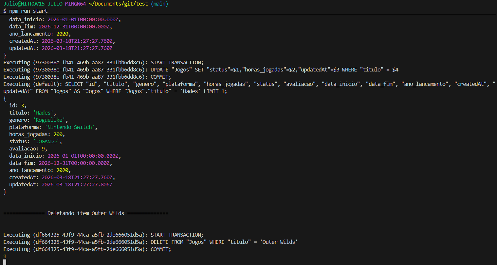

# 🎮 Gerenciador de Jogos com Sequelize + PostgreSQL

Este projeto é uma aplicação backend desenvolvida em **Node.js** utilizando o **Sequelize ORM** para gerenciamento de jogos e suas coleções.

O sistema implementa operações completas de banco de dados (**CRUD**), incluindo:

* Relacionamento **N:N (muitos para muitos)**
* Uso de **transactions**
* **Validações customizadas**
* Consultas avançadas com ORM (equivalente a JOIN)

---

## 🛠️ Tecnologias Utilizadas

* Node.js
* PostgreSQL
* Sequelize ORM
* pg / pg-hstore
* dotenv

---

## 📦 Instalação

### 1. Clonar o repositório

```bash
git clone <repo-url>
cd <repo>
```

### 2. Instalar dependências

```bash
npm install
```

### 3. Configurar variáveis de ambiente

Crie um arquivo `.env` na raiz:

```env
USER=seu_usuario
PASSWORD=sua_senha
HOST=localhost
PORT=5432
DB=nome_do_banco
```

### 4. Executar o projeto

```bash
npm start
```

---

## ⚙️ Estrutura do Projeto

```
📁 models/
 ├── Jogos.js
 ├── Colecoes.js
 ├── Jogo_colecao.js

📁 seeds/
 ├── data.js
 ├── handleData.js

📄 config.js
📄 index.js
```

---

## 🧠 Modelagem do Banco

### 🎮 Jogos

Tabela principal contendo:

* título (único por plataforma)
* gênero
* plataforma
* horas jogadas
* status (ENUM)
* avaliação (0 a 10)
* data de início e fim
* ano de lançamento

### 📚 Coleções

* nome (único)
* descrição

### 🔗 Jogo_colecao (Tabela intermediária)

Responsável pelo relacionamento **N:N** entre jogos e coleções.

---

## 🔗 Relacionamentos

```js
Jogos.belongsToMany(Colecoes, {
    through: Jogo_colecao,
    foreignKey: 'jogo_id',
    otherKey: 'colecao_id',
    onDelete: 'CASCADE',
    onUpdate: 'CASCADE'
});

Colecoes.belongsToMany(Jogos, {
    through: Jogo_colecao,
    foreignKey: 'colecao_id',
    otherKey: 'jogo_id',
    onDelete: 'CASCADE',
    onUpdate: 'CASCADE'
});
```

✔ Um jogo pode pertencer a várias coleções
✔ Uma coleção pode conter vários jogos
✔ Exclusão em cascata garante integridade

---

## 🔄 Uso de Transações

O projeto utiliza transactions para garantir consistência dos dados:

```js
const transaction = await sequelize.transaction();

try {
    // operações no banco
    await transaction.commit();
} catch (e) {
    await transaction.rollback();
}
```

✔ Evita dados inconsistentes
✔ Garante rollback em caso de erro

---

## 📥 Inserção de Dados

### Função: `insertData()`

* Insere jogos e coleções em lote (`bulkCreate`)
* Cria relações manualmente na tabela intermediária
* Usa transaction para garantir integridade

---

## 🔍 Consultas com ORM

### 🔗 1. Listar jogos com suas coleções (JOIN)

```js
Jogos.findAll({
    include: {
        model: Colecoes,
        attributes: ['nome', 'descricao'],
        through: { attributes: [] }
    }
});
```

✔ Remove dados da tabela intermediária
✔ Retorna apenas dados relevantes

---

### 🎯 2. Filtrar jogos por coleção

```js
Jogos.findAll({
    include: {
        model: Colecoes,
        where: { nome: "RPG Favoritos" },
        attributes: [],
        through: { attributes: [] }
    }
});
```

---

### 📊 3. Filtro + Ordenação (Top jogos)

```js
Jogos.findAll({
    where: {
        status: "NÃO INICIADO"
    },
    order: [
        ['avaliacao', 'DESC'],
        ['data_fim', 'DESC']
    ],
    limit: 10
});
```

✔ Ordenação por múltiplos critérios
✔ Limite de resultados (Top 10)

---

## ✏️ Atualização de Dados

### Função: `atualizarStatusJogo()`

```js
Jogos.update(
    {
        status: "JOGANDO",
        horas_jogadas: 200
    },
    {
        where: { titulo: "Hades" }
    }
);
```

✔ Atualização com filtro
✔ Uso de transaction
✔ Validação de linhas afetadas

---

## ❌ Remoção de Dados

### Função: `deletarJogoPorTitulo()`

```js
Jogos.destroy({
    where: { titulo: "Hades" }
});
```

✔ Remove registro do banco
✔ CASCADE remove automaticamente relações
✔ Mantém integridade referencial

---

## 🧪 Validações Implementadas

### ✔ No Model Jogos

* `horas_jogadas` não pode ser negativa
* `data_fim` deve ser maior ou igual à `data_inicio`
* `avaliacao` deve estar entre 0 e 10

```js
validate: {
    endDateLessThanStart() {
        this.BiggerThan();
    }
}
```

---

## ▶️ Execução do Projeto

O arquivo `index.js` é responsável por:

1. Autenticar conexão com o banco
2. Criar tabelas (`sequelize.sync()`)
3. Executar operações principais:

```js
await insertData();
await jogosEColecoes();
await jogosPorColecao("RPG Favoritos");
await encontrarPorTitulo("Hades");
await atualizarStatusJogo("JOGANDO", { titulo: "Hades" });
await mostrarTopJogos();
await deletarJogoPorTitulo("Outer Wilds");
```

---

## ⚠️ Boas Práticas Aplicadas

* Uso de transactions em operações críticas
* Modelagem correta de relacionamento N:N
* Constraints únicas para evitar duplicidade
* Separação de responsabilidades (models, seeds, config)
* Validação de dados no nível do model


## 📄 Referências

* https://sequelize.org/docs/v6/core-concepts/model-querying-finders/
* https://nodejs.org/en


## 📸 Provas do funcionamento

<p align="center">
  
</p>